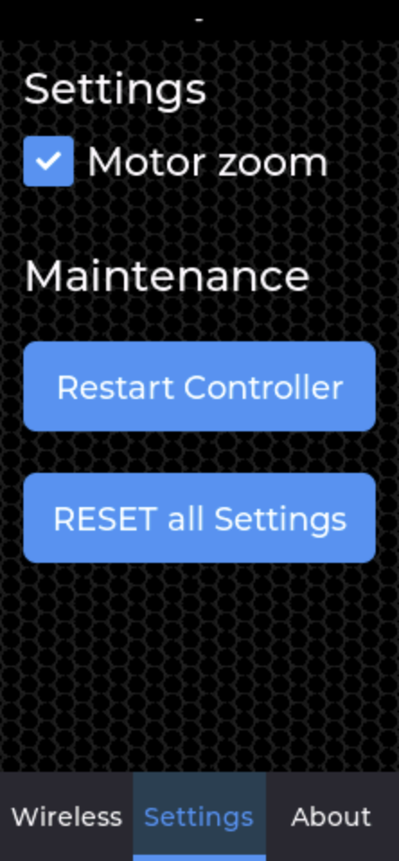
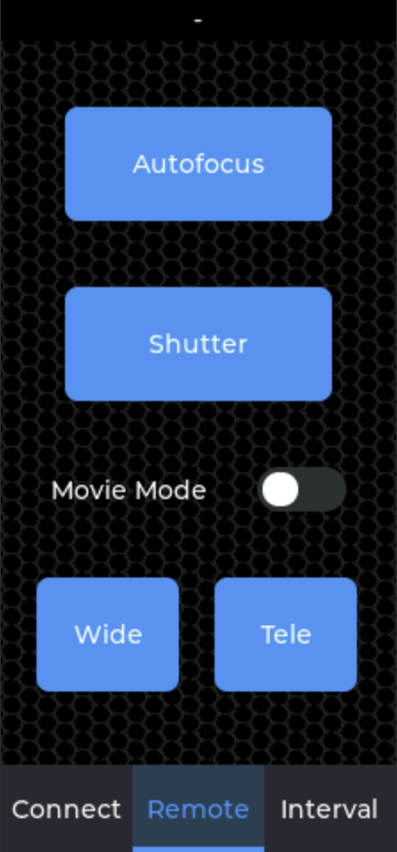
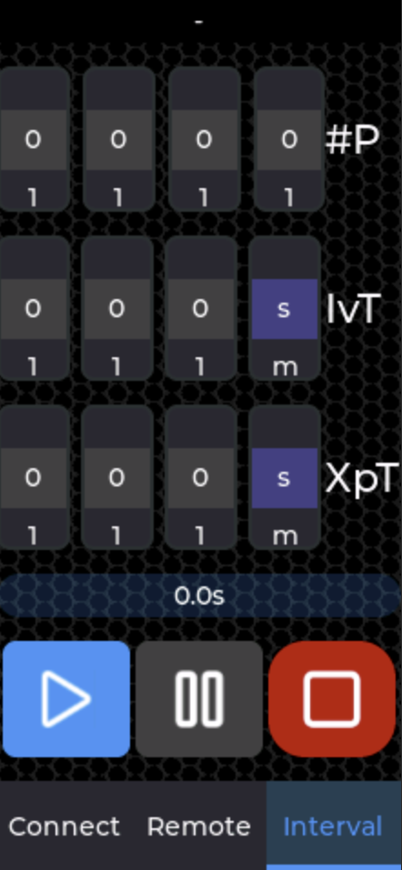

# CameraControlBT-TDS3P for Canon digital cameras with Bluetooth connectivity, based to LILIGO® T-Display S3 Pro

## Hint

If you have "stottering" communication, use an external battery with more power.

### Successfully tested cameras
- Canon EOS M50
- Canon EOS M6 Mark II
- Canon EOS R100
- Canon EOS R6 Mark II
- Canon PowerShot G7X Mark III (incl. motor zoom)

## Hardware

- [LILIGO® T-Display S3 Pro](https://www.lilygo.cc/products/t-display-s3-pro)

## Build environment

- [PlatformIO](https://platformio.org/)
  - [Choosing PlatformIO IDE for VSCode](https://platformio.org/install/ide?install=vscode)
- [Visual Studio Code](https://code.visualstudio.com/)
- [SquareLine Studio](https://squareline.io/) - UI Design

### Alternative build with `docker compose`

If you like to have a fully clean build environment you can use docker for this purpose.

#### Install

- [Docker Desktop](https://www.docker.com/products/docker-desktop/)

#### Build 

Change to [docker/](docker/) directory an follow the instructions of the README.md document.

## Upload Firmware

`pio run -t upload`

## Screeshots

### Start screen

### Settings screen

### Bluetooth remote control screen

### Intervalometer

- #P : number of pictures to take

- IvT : Interval time between shots

- XpT : Exposure time, if XpT > IvT then IvT is set to 0s. Setting the Exposure time only makes sense in *BULB* mode. Minimum time between shots is 4s.
